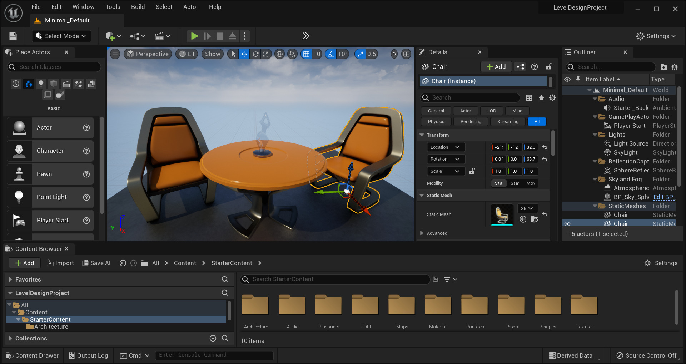

 # PointCloud Mesh Segmentation from AirSim Simulated Depth Images

 ## Table of Contents
1. [Introduction](#introduction)
    1. [About LTU's Robotics & AI Team](#about-ltus-robotics-and-ai-team)
    2. [About ROS](#about-ros)
    3. [About Unreal](#about-unreal)
    4. [About Microsoft AirSim](#about-microsoft-airsim)
        1. [What are Meshes?](#what-are-meshes)
        2. [What is Segmentation?](#what-is-segmentation)
        3. [What are Depth Images?](#what-are-depth-images)
    5. [About Matterport 3D Research Dataset](#about-matterport-3d-research-dataset)
2. [Research Methodology](#research-methodology)
    1. [Installation (Ubuntu Focal 20.04)](#installation-ubuntu-focal-2004)
    2. [AirSim Simulation](#airsim-simulation)
    4. [Dataset Generation](#dataset-generation)

## Introduction

### [About LTU's Robotics and AI Team](https://www.ltu.se/research/subjects/RoboticsAI?l=en)

LTU's Robotics & AI lab is a specialized facility where researchers, engineers, and students work on various aspects of robotics. It is equipped with state-of-the-art hardware and software tools that enable the design, development, and testing of robotic systems. 

The lab serves as a creative and collaborative space for exploring innovative solutions, integrating artificial intelligence, and advancing the field of robotics. It provides an ideal environment for hands-on learning, experimentation, and pushing the boundaries of technological advancements in robotics.

<table>
<tr>
<td></td>
<td></td>
</tr>
</table>

### [About ROS](https://www.ros.org/)

The Robot Operating System (ROS) is a set of open source software libraries and tools that help you build robot applications. The version used was ROS Noetic Ninjemys, the latest ROS 1 LTS Release targeted at the Ubuntu 20.04 (Focal) release. Some of its key features include:

* Middleware Communication through a set of nodes (independent software modules) that publish and subscribe to data, making it easy to exchange information within the robot's ecosystem.

* Package Management: ROS uses a package-based architecture, where functionalities are organized into individual packages.

* Hardware Abstraction: ROS provides hardware abstraction, allowing developers to interface with various sensors, actuators, and robots in a standardized way.

* Visualization and Debugging: ROS includes visualization tools that help developers monitor and debug the robot's behavior, visualize sensor data, and understand the system's state during runtime.

* Language Support: ROS supports multiple programming languages, with Python and C++ being the most commonly used.

### [About Unreal 4.27](https://www.unrealengine.com/en-US/blog/unreal-engine-4-27-released)

A game development engine is a software framework that provides developers with tools, libraries, and pre-built functionalities to create and develop video games and interactive experiences. Unreal Engine 4.27 is a real-time 3D engine designed to create cutting-edge games, real-time visualizations, and immersive interactive experiences.

<table>
<tr>
<td></td>
<td></td>
</tr>
</table>

### [About Microsoft Airsim](https://github.com/microsoft/AirSim)

Microsoft AirSim is an open-source simulation platform developed by Microsoft Research for autonomous systems, primarily focusing on autonomous vehicles and drones. AirSim provides a realistic 3D environment for testing and developing algorithms related to perception, control, and planning in a safe and controlled virtual space.

* Realistic Simulations: AirSim provides high-fidelity simulations, enabling developers to test their algorithms in various environments, terrains, and weather conditions. The simulated environment includes accurate physics, lighting, and sensor models.

* Sensor Simulation: AirSim supports various sensors used in autonomous systems, including RGB cameras, depth cameras, LiDAR, and GPS. This allows developers to obtain sensor data and test their perception and mapping algorithms in a virtual setting.

* API and Integration: AirSim offers a well-documented API, allowing developers to integrate their algorithms and control logic with the simulation environment easily. This integration makes it easier to test and validate real-world algorithms before deploying them on physical robots or vehicles.

<table>
<tr>
<td></td>
<td></td>
</tr>
<tr>
<td></td>
<td></td>
</tr>
</table>

#### What are Meshes?

#### What is Segmentation?

#### What are Depth Images?

### [About Matterport 3D Research Dataset](https://github.com/matterport/habitat-matterport-3dresearch)

## Research Methodology

### Installation (Ubuntu Focal 20.04)

### AirSim Simulation

### Dataset Generation