 # PointCloud Mesh Segmentation from AirSim Simulated Depth Images

 ## Table of Contents
1. [Introduction](#introduction)
    1. [About LTU's Robotics & AI Team](#about-ltus-robotics-and-ai-team)
    2. [About ROS](#about-ros)
    3. [About Unreal](#about-unreal)
    4. [About Microsoft AirSim](#about-microsoft-airsim)
        1. [What are Meshes?](#what-are-meshes)
        2. [What is Segmentation?](#what-is-segmentation)
        3. [What are Depth Images?](#what-are-depth-images)
    5. [About Matterport 3D Research Dataset](#about-matterport-3d-research-dataset)
2. [Research Methodology](#research-methodology)
    1. [Installation (Ubuntu Focal 20.04)](#installation-ubuntu-focal-2004)
    2. [AirSim Simulation](#airsim-simulation)
    4. [Dataset Generation](#dataset-generation)


## Introduction

### [About LTU's Robotics and AI Team](https://www.ltu.se/research/subjects/RoboticsAI?l=en)

LTU's Robotics & AI lab is a specialized facility where researchers, engineers, and students work on various aspects of robotics. It is equipped with state-of-the-art hardware and software tools that enable the design, development, and testing of robotic systems. 

The lab serves as a creative and collaborative space for exploring innovative solutions, integrating artificial intelligence, and advancing the field of robotics. It provides an ideal environment for hands-on learning, experimentation, and pushing the boundaries of technological advancements in robotics.

<table>
<tr>
<td>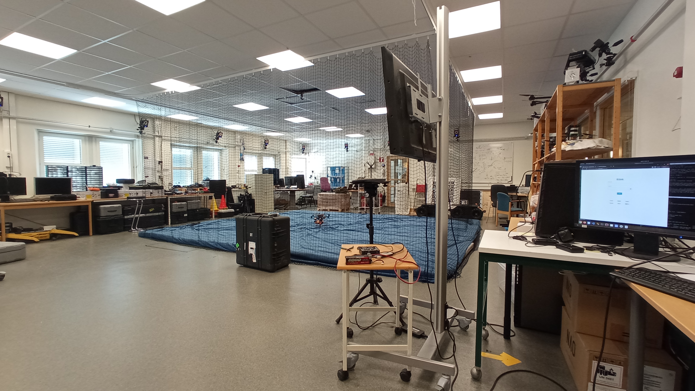</td>
<td>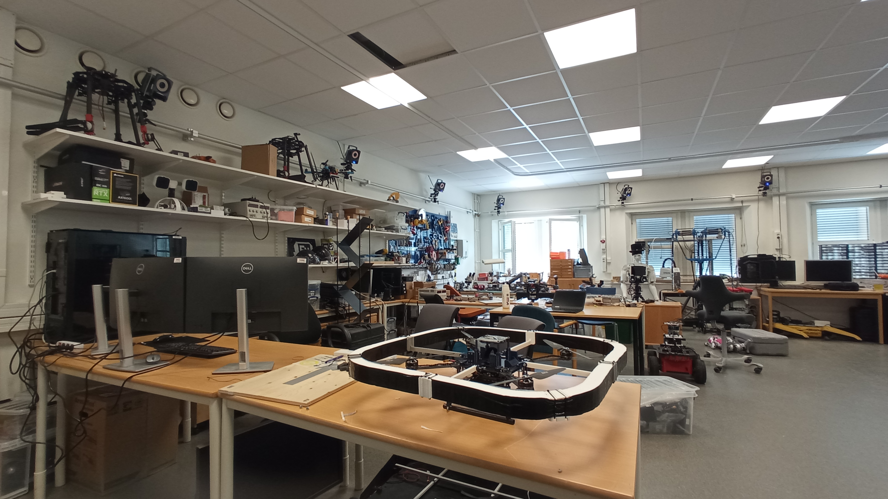</td>
</tr>
</table>

### [About ROS](https://www.ros.org/)

The Robot Operating System (ROS) is a set of open source software libraries and tools that help you build robot applications. The version used was ROS Noetic Ninjemys, the latest ROS 1 LTS Release targeted at the Ubuntu 20.04 (Focal) release. Some of its key features include:

* Middleware Communication through a set of nodes (independent software modules) that publish and subscribe to data, making it easy to exchange information within the robot's ecosystem.

* Package Management: ROS uses a package-based architecture, where functionalities are organized into individual packages.

* Hardware Abstraction: ROS provides hardware abstraction, allowing developers to interface with various sensors, actuators, and robots in a standardized way.

* Visualization and Debugging: ROS includes visualization tools that help developers monitor and debug the robot's behavior, visualize sensor data, and understand the system's state during runtime.

* Language Support: ROS supports multiple programming languages, with Python and C++ being the most commonly used.

### [About Unreal 4.27](https://www.unrealengine.com/en-US/blog/unreal-engine-4-27-released)

A game development engine is a software framework that provides developers with tools, libraries, and pre-built functionalities to create and develop video games and interactive experiences. Unreal Engine 4.27 is a real-time 3D engine designed to create cutting-edge games, real-time visualizations, and immersive interactive experiences.

<table>
<tr>
<td>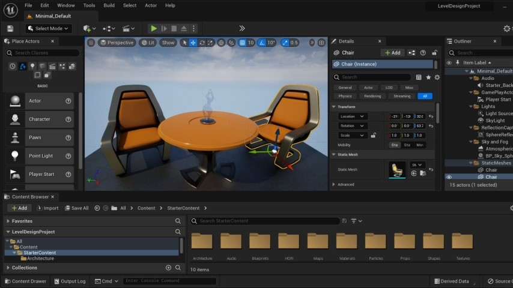</td>
<td>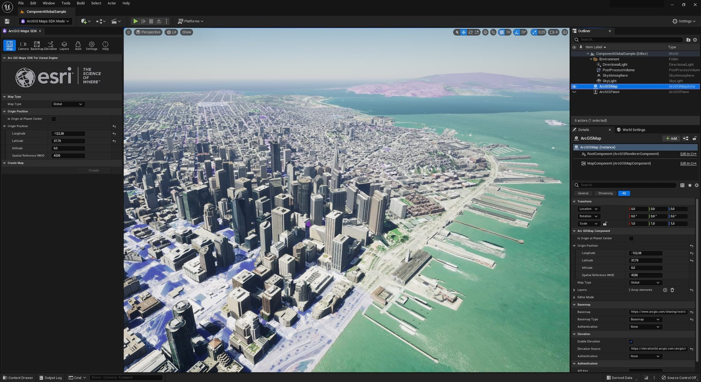</td>
</tr>
</table>

### [About Microsoft Airsim](https://github.com/microsoft/AirSim)

Microsoft AirSim is an open-source simulation platform developed by Microsoft Research for autonomous systems, primarily focusing on autonomous vehicles and drones. AirSim provides a realistic 3D environment for testing and developing algorithms related to perception, control, and planning in a safe and controlled virtual space.

* Realistic Simulations: AirSim provides high-fidelity simulations, enabling developers to test their algorithms in various environments, terrains, and weather conditions. The simulated environment includes accurate physics, lighting, and sensor models.

* Sensor Simulation: AirSim supports various sensors used in autonomous systems, including RGB cameras, depth cameras, LiDAR, and GPS. This allows developers to obtain sensor data and test their perception and mapping algorithms in a virtual setting.

* API and Integration: AirSim offers a well-documented API, allowing developers to integrate their algorithms and control logic with the simulation environment easily. This integration makes it easier to test and validate real-world algorithms before deploying them on physical robots or vehicles.

<table>
<tr>
<td>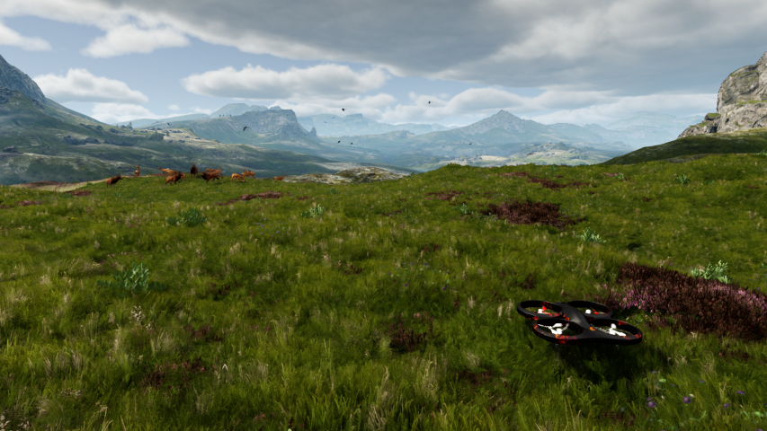</td>
<td>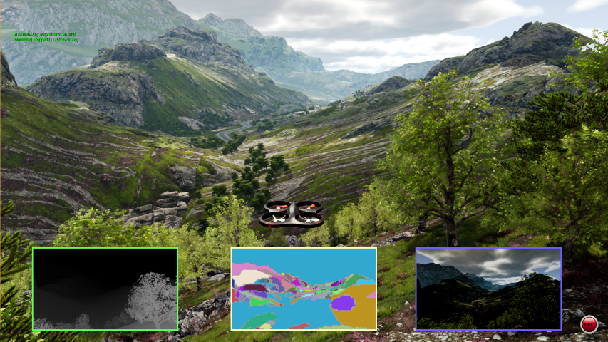</td>
</tr>
<tr>
<td><a href="https://youtu.be/-WfTr1-OBGQ">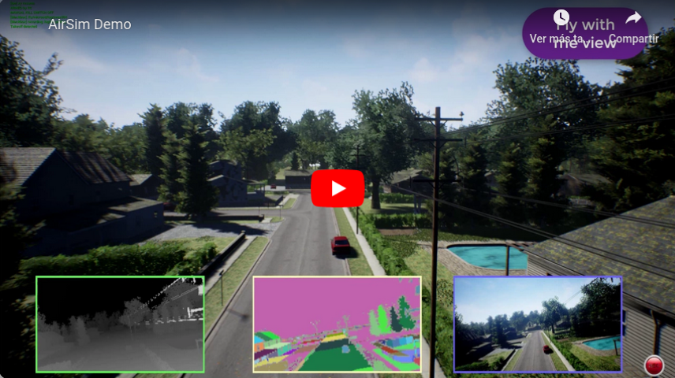</a>
<p align='Center'>AirSim Demo</p>
</td>
<td><a href="https://youtu.be/vL2GVqfyvn0"></a>
<p align='Center'>AirSim HelloDrone Example</p>
</td>
</tr>
</table>

#### What are Meshes?

In computer graphics and 3D modeling, a mesh is a collection of vertices, edges, and faces that together form the shape of a 3D object. It is one of the fundamental data structures used to represent 3D geometry in computer graphics and is widely used in various applications, including video games, animation, virtual reality, and simulation.

By combining vertices, edges, and faces, a mesh can accurately represent complex 3D shapes. Meshes can be textured, shaded, and manipulated to create realistic 3D objects and scenes in computer graphics applications.

#### What is Segmentation?

Segmentation, in the context of computer vision and image processing, refers to the process of dividing an image into distinct regions or segments based on certain criteria. The goal of segmentation is to identify and group pixels or regions that share similar visual characteristics or properties.

Segmentation is a fundamental step in many computer vision tasks, including object detection, image recognition, image editing, and medical image analysis. It plays a crucial role in separating objects of interest from the background, enabling further analysis and decision-making in various applications. The quality and accuracy of the segmentation directly impact the success of downstream tasks that rely on understanding the content of the images.

#### What are Depth Images?

Depth images, also known as depth maps or depth images, are a type of image that contains information about the distance of objects or surfaces from the camera or sensor that captured the image. In contrast to regular 2D images, which only provide color and intensity information, depth images add an additional dimension that represents the distance or depth of each pixel in the scene.

Depth images are typically represented as grayscale images, where darker pixels correspond to closer objects, and lighter pixels correspond to objects farther away. The depth information is often encoded as a single-channel image, where each pixel value represents the distance from the camera to the corresponding point in the scene.

## Research Methodology

### Installation (Ubuntu Focal 20.04)

#### [Unreal Engine](https://github.com/EpicGames/UnrealEngine.git)
* For downloading the source code it is necessary to join the Epic Games Github organization as explained in this [tutorial](https://docs.unrealengine.com/4.27/en-US/SharingAndReleasing/Linux/BeginnerLinuxDeveloper/SettingUpAnUnrealWorkflow/). 
* An error '*Engine Modules out of Date*' was encountered during compilation of Unreal which is solved in the following [Epic Games Forum](https://forums.unrealengine.com/t/how-to-solve-engine-modules-are-out-of-date/564119/2). 
```
# Download source code
git clone -b 4.27 https://github.com/EpicGames/UnrealEngine.git

# Give permissions and setup project
chmod u+x Setup.sh; ./Setup.sh
chmod u+x GenerateProjectFiles.sh; ./GenerateProjectFiles.sh

# Build source code
make
```

#### [AirSim Microsoft](https://github.com/ethz-asl/AirSim.git)

AirSim Microsoft exposes a C++ API that can be used with both C++ or Python clients. An ROS Wrapper is also provided, that together with the API allows the straightforward edition of e.g. vehicle pose or orientation and feedback from the simulation in the form of e.g. images or world meshes. 

```
# Install dependencies
sudo apt-get install libboost-all-dev

# Download source code
git clone https://github.com/ethz-asl/AirSim.git

# Set the target destination.
export AIRSIM_PATH=PATH_TO_AIRSIM_FOLDER
cd $AIRSIM_PATH

# Setup project and build source code
chmod u+x setup.sh; ./setup.sh 
chmod u+x build.sh; ./build.sh

#------------------------------------------------------------#
#             Python API (AirSim/PythonClient)               #
#------------------------------------------------------------#

# Install dependencies
pip install msgpack-rpc-python

#------------------------------------------------------------#
#              Airsim ROS Wrapper (AirSim/ros)               #
#------------------------------------------------------------#

# Install ROS dependencies
sudo apt-get install \
    ros-noetic-tf2-sensor-msgs \
    ros-noetic-tf2-geometry-msgs \
    ros-noetic-mavros*
pip install "git+https://github.com/catkin/catkin_tools.git#egg=catkin_tools"  # Ubuntu 20.02

# Build catkin workspace
echo "source /opt/ros/noetic/setup.bash" >> ~/.bashrc
source ~/.bashrc
catkin build;
```

#### [ETH-Zürich ASL Unreal AirSim](https://github.com/ethz-asl/unreal_airsim.git)

ETH-Zürich Autonomous Systems Lab (ASL) offers an ROS package for handling the different coordinates and metrics used in Unreal, Airsim and ROS together with its own wrapper. The available topics are reduced in comparison with AirSim's ROS Wrapper but it offers the postprocessing of Scene, Segmentation and Depth images for obtaining a 3D Colored PointCloud (RGBA).

```
# Install ROS dependencies
sudo apt-get install \
    python3-wstool \
    python3-catkin-tools \
    ros-noetic-cmake-modules \
    ros-noetic-tf2-sensor-msgs \
    python-is-python3

# Upgrade dependencies
pip3 install --upgrade scipy

# Download source code
git clone https://github.com/ethz-asl/unreal_airsim.git
wstool init . .rosinstall  # If non existant
wstool update

# Build catkin workspace
cd ~/ros-airsim/workspace/src/unreal_airsim/
echo "set(AIRSIM_ROOT $AIRSIM_PATH)" > ./AirsimPath.txt
catkin build unreal_airsim
```

#### [ROS Image Pipeline](https://wiki.ros.org/image_pipeline)

Another possibility for obtaining an RGBA PointCloud by handling Scene and Depth images is the ROS image_pipeline group package, that offers the **depth_image_proc** package. The package contains nodelets for processing depth images such as those produced by [OpenNI Camera](https://dev.intelrealsense.com/docs/openni-wrapper). Functions include creating disparity images and point clouds, as well as registering (reprojecting) a depth image into another camera frame.

```
# Install dependencies and ROS package
sudo apt-get install \
    ros-noetic-image-pipeline \
    ros-noetic-nodelet
```

### AirSim Simulation

#### Unreal Engine

The AirSim Blocks environment has been edited to form a rectangle with different geometry objects and allow a more straightforward segmentation comparison. The files that need to be substituted in the original project can be found under [*/workspace/src/Unreal*](/workspace/src/Unreal/) with the same folder structure.

```
# Start Editor
./UnrealEngine-4.27/Engine/Binaries/Linux/UE4Editor

# Start Editor with .uproject -> UnrealEngine & AirSim expected to be in the same folder
# ./UnrealEngine-4.27/Engine/Binaries/Linux/UE4Editor ../../../../AirSim/Unreal/Environments/ProjectName/ProjectName.uproject
```

#### AirSim Microsoft

The available C++ API calls together with the provided ROS Wrapper topics have been written down and can be seen under the [*/docs/api*](/docs/api/) folder.

AirSim utilizes a JSON settings file that should be located by default under *~/Documents/Airsim* . An example is provded under [*/docs/settings*](/docs/settings/) for both a multirotor vehicle (with Scene, Segmentation and Depth cameras) and the CV mode (i.e. no world physics or vehicle). 

Python scripts for these two settings are available under [*/workspace/src/simulation/scripts/airsim/multirotor/blocks*](/workspace/src/simulation/scripts/airsim/multirotor/blocks) (1) that use the Python client for changing the position and orientation of the vehicle or camera respectively.

```
#------------------------------------------------------------#
#             Python API (AirSim/PythonClient)               #
#------------------------------------------------------------#

# Run AirSim Drone Example
cd AirSim/PythonClient/multirotor; python3 hello_drone.py  

#------------------------------------------------------------#
#              Airsim ROS Wrapper (AirSim/ros)               #
#------------------------------------------------------------#

source devel/setup.bash;
roslaunch airsim_ros_pkgs airsim_node.launch;  # Launch ROS wrapper
roslaunch airsim_ros_pkgs rviz.launch;  # Launch RVIZ visualizer
```

#### ETH-Zürich ASL Unreal AirSim

The ETH package uses similar settings as AirSim but in a YAML fashion. An example can be seen under [*/docs/settings*](/docs/settings/) where the postprocessing is done for obtaining the PointCloud and applying Infrared Compensation.

The Depth camera type used is **Depth Perspective**, however the distance in the images needs to be transformed to the plane with the Python script [*/workspace/src/simulation/scripts/airsim/depth_conversion.py*](/workspace/src/simulation/scripts/airsim/depth_conversion.py) (2) which generates the topic that the settings will subscribe to.

```
# Parse generic configuration
roslaunch unreal_airsim parse_config_to_airsim.launch

# Parse specific configuration
# roslaunch unreal_airsim parse_config_to_airsim.launch source:=path/to/my_settings.yaml

# Launch ROS package
roslaunch unreal_airsim demo.launch
```

The results of the simulation can be seen in the images below obtained from RVIZ visualizer. The 3D projection of the RGBA PointCloud is obtained with color respectively from the Scene and the Segmentation cameras. 
* The clickable video in the left shows the provided Unreal Blocks environment and the result of changing the position and orientation of the multirotor vehicle [(1)](/workspace/src/simulation/scripts/airsim/multirotor/blocks). 
* The clickable video in the right shows the result of the simulation obtained from the ROS wrapper provided by ETH, visualizing the images obtained from the sensor and the generated PointCloud after transforming the Depth image [(2)](/workspace/src/simulation/scripts/airsim/depth_conversion.py).

<table>
<tr>
<td>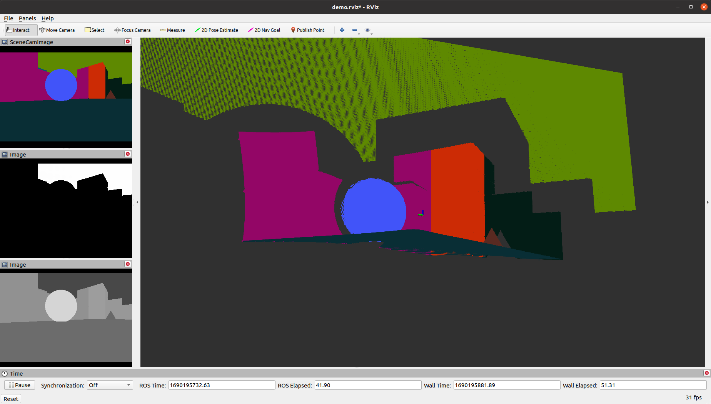</td>
<td>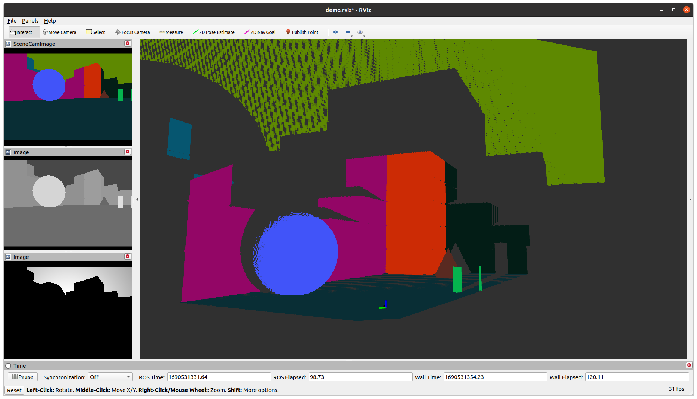</td>
</tr>
<tr>
<td><a href="https://youtu.be/Hcabzt2qfYs">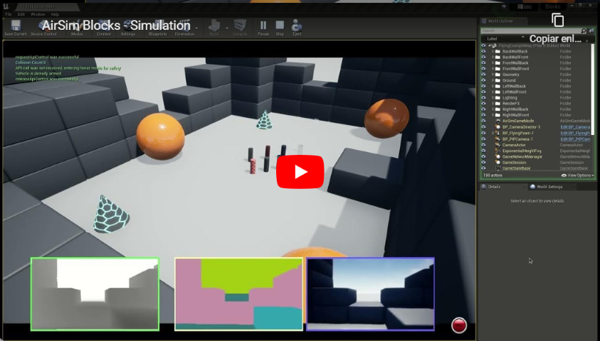</a>
<p align='Center'>AirSim Blocks - Simulation</p>
</td>
<td><a href="https://youtu.be/D-7ADvh2-3Q">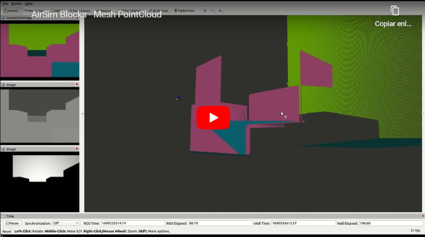</a>
<p align='Center'>AirSim Blocks - Mesh PointCloud</p>
</td>
</tr>
</table>

### Dataset Generation

With the AirSim simulation and the ETH-Zürich ROS wrapper, a segmentation dataset has been obtained in the form of the following ROS custom message recorded as a rosbag:
* **odom_gt** :: The real time ground truth odometry of the vehicle wrt.. the AirSim Coordinates.
* **mesh_location_gt** :: The absolute location of the meshes wrt.. the Unreal Coordinates.
* **seg_img** :: The segmentation image obtained from the camera sensor.
* **mesh_ids** :: The meshes recognized by color in the segmentation image and saved as an array of color IDs ([*/docs/segmentation/seg_rgbs.txt*](/docs/segmentation/seg_rgbs.txt))
* **mesh_location** :: The relative position of the recognized meshes wrt.. the current position of the drone in ASL coordinates (orientation not considered).

The custom message with the ROS types is displayed below.

```
nav_msgs/Odometry odom_gt                   # Ground Truth Odometry
geometry_msgs/PoseArray mesh_location_gt    # Ground Truth Mesh Locations

sensor_msgs/Image seg_img                   # Segmentation Image
std_msgs/UInt8MultiArray mesh_ids           # Mesh Components by ID
geometry_msgs/PoseArray mesh_location       # Mesh Locations by Pose
```

#### Coordinate Systems Transform

The positional information of the meshes along with the vehicle's odometry are obtained from the AirSim Python client. However, the mesh position is defined on the Unreal coordinate system where as the odometry is in the AirSim coordinate system.

In the image below obtained from the [ETH-Zürich Repository](https://github.com/ethz-asl/unreal_airsim/blob/master/docs/coordinate_systems.md) the different coordinates used are shown where AirSim uses [NED (Noth East Down)](https://en.wikipedia.org/wiki/Local_tangent_plane_coordinates) coordinates and the ETH ROS package uses [ASL](https://www.ros.org/reps/rep-0103.html) (i.e. Right-hand Rule). Moverover, Unreal uses Centimeters as metrics whereas AirSim uses Meters. The following equations are used to transform the absolute position of the meshes wrt. Unreal coordinates into the relative position wrt. AirSim's vehicle position.


Let's start by considering the coordinate transformations:

$$ 
\begin{aligned}
10^{-2}*x^U = x^A = x^R && && 
10^{-2}*y^U = y^A = -y^R && &&  
10^{-2}*z^U = -z^A = z^R
\end{aligned} \\

Considering \ all \ coordinates \ to \ be \ in \ meters \\
U = Unreal \ \  \ A = AirSim \ \ \  R = ROS
$$

The first step is to find the absolute start position of the Mesh and the Multirotor Vehicle wrt. AirsSim world:

$$ 
\begin{aligned}
\overrightarrow{p}^U_0=[x^U_{p0}, y^U_{p0}, z^U_{p0}] && &&
&& && 
\overrightarrow{m}^U_t=[x^U_{mt}, y^U_{mt}, z^U_{mt}] && && 
Absolute \ position \ wrt. \ Unreal \ World \\

\overrightarrow{p}^A_0=[x^A_{p0}, y^A_{p0}, z^A_{p0}] && &&
\overrightarrow{p}^A_t=[x^A_{pt}, y^A_{pt}, z^A_{pt}] && && 
\overrightarrow{m}^A_t=[x^A_{mt}, y^A_{mt}, z^A_{mt}] && && 
Absolute \ position \ wrt. \ AirSim \ World
\end{aligned} \\ 
$$

$$
Where \ \overrightarrow{p} \ is \ the \ Position \ of \ the \ Multirotor \ Vehicle \\
Where \ \overrightarrow{m} \ is \ the \ Position \ of \ the \ Mesh \\
$$

$$ 
\begin{aligned}
\overrightarrow{p}^A_0=[x^A_{p0}, y^A_{p0}, z^A_{p0}] && &&
x^A_{p0} = 10^{-2} * x^U_{p0} && && 
y^A_{p0} = 10^{-2} * y^U_{p0} && && 
z^A_{p0} = - 10^{-2} * z^U_{p0} \\
\end{aligned} \\
$$

$$ 
\begin{aligned}
\overrightarrow{m}^A_t=[x^A_{mt}, y^A_{mt}, z^A_{mt}] && && 
x^A_{mt} = 10^{-2} * x^U_{mt} && && 
y^A_{mt} = 10^{-2} * y^U_{mt} && && 
z^A_{mt} = - 10^{-2} * z^U_{mt} \\
\end{aligned} \\
$$

The second step is to obtain the relative position of the Mesh wrt. the Multirotor Vehicle in AirSim coordinates. It's necessary to substract the initial position of the Multirotor Vehicle as the position obtained from the AirSim simulation is considered to be [0, 0, 0] while adding the current position for shifting that of the meshes at every timestep t :

$$
\overrightarrow{m}^{Ar}_t=[x^{Ar}_{mt}, y^{Ar}_{mt}, z^{Ar}_{mt}]
$$

$$
\begin{aligned}
x^{Ar}_{mt} = x^A_{pt} + (x^A_{mt} - x^A_{p0}) && && 
y^{Ar}_{mt} = y^A_{pt} + (y^A_{mt} - y^A_{p0}) && && 
z^{Ar}_{mt} = z^A_{pt} + (z^A_{mt} - z^A_{p0})
\end{aligned} \\
$$

The last step is to transform the relative position of the Mesh wrt.. the Multirotor Vehicle into ROS coordinates:

$$
\overrightarrow{m}^{Rr}_t=[x^{Rr}_{mt}, y^{Rr}_{mt}, z^{Rr}_{mt}]
$$

$$
\begin{aligned}
x^{Rr}_{mt} = x^{Ar}_{mt} = x^A_{pt} + (x^A_{mt} - x^A_{p0}) && &&  
y^{Rr}_{mt} = - y^{Ar}_{mt} = -(y^A_{pt} + (y^A_{mt} - y^A_{p0})) && &&
z^{Rr}_{mt} = - z^{Ar}_{mt} = -(z^A_{pt} + (z^A_{mt} - z^A_{p0}))
\end{aligned} \\
$$

An array of these positional vectors is published as **mesh_location** in the custom message when identified in the segmentation images. The code can be accessed in [/workspace/src/simulation/scripts/airsim/segmentation/blocks/mesh_handler.py](/workspace/src/simulation/scripts/airsim/segmentation/blocks/mesh_handler.py)


